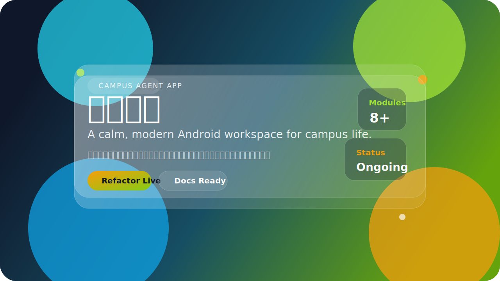

  

# 南工破晓

<strong>把校园学习、个人效率和 Agent 能力，收束成一个更安静的 Android 工作台。</strong>

  
  
  

  
  
  

  <a href="#核心入口">核心入口</a> ·
  <a href="#信息架构">信息架构</a> ·
  <a href="#设计规范">设计规范</a> ·
  <a href="#迭代时间线">迭代时间线</a> ·
  <a href="#维护入口">维护入口</a>

> [!IMPORTANT]
> 这版 README 以 GitHub 原生渲染能力为边界进行重设计。  
> 已落地的“特效”包括渐变主视觉、SVG 动效、视觉卡片分组和更清晰的层级结构。  
> `真实悬停效果 / JS 级过渡 / 交互式 3D` 不属于 GitHub README 可执行范围，因此这里给出可运行替代方案与后续落地规范，而不是伪实现。

## 项目定位

`南工破晓` 是一个面向校园学习与个人效率场景的 Android 原生应用，采用 `Kotlin + Jetpack Compose` 构建，并持续以 `Agent` 驱动方式进行重构、维护和文档沉淀。

它试图解决的不是“功能不够多”，而是“大学生活中的信息太散、入口太碎、操作太跳”。  
课表、教务、待办、复习、专注、信息流、校园服务与智能体建议，被重新组织成一条低干扰、连续、可维护的使用路径。

## 核心入口

<table>
  <tr>
    <td width="50%">
      <h3>学习主线</h3>
      
课表、考试周、复习计划、课程相关入口。

      
<code>schedule</code> · <code>review</code> · <code>notes</code>

    </td>
    <td width="50%">
      <h3>执行主线</h3>
      
待办、专注、学习数据、记录与导出。

      
<code>todo</code> · <code>pomodoro</code> · <code>reports</code>

    </td>
  </tr>
  <tr>
    <td width="50%">
      <h3>校园主线</h3>
      
校园服务、地图、信息流、通知触达。

      
<code>campus</code> · <code>notifications</code>

    </td>
    <td width="50%">
      <h3>智能体主线</h3>
      
上下文读取、权限控制、工具编排和动作型建议。

      
<code>data</code> · <code>security</code> · <code>ui</code>

    </td>
  </tr>
</table>

## 信息架构

<table>
  <tr>
    <td width="33%">
      <h3>第一层</h3>
      
<strong>品牌与状态</strong>

      
主视觉、项目一句话、核心状态徽章、快速导航。

    </td>
    <td width="33%">
      <h3>第二层</h3>
      
<strong>功能与结构</strong>

      
核心入口、模块分组、当前能力、智能体价值。

    </td>
    <td width="33%">
      <h3>第三层</h3>
      
<strong>维护与演进</strong>

      
时间线、设计规范、移动端策略、测试与维护入口。

    </td>
  </tr>
</table>

- 采用“单列叙事 + 横向卡片分组”的方式，避免大表格连续堆叠导致的阅读疲劳。
- 让核心入口前置，确保功能入口可见性不低于现有版本。
- 将视觉元素集中在首屏和分区标题，避免整页每一处都抢焦点。

## 视觉亮点

- `渐变主视觉`：顶部使用自定义 `SVG` 生成深色渐变、发光点和玻璃拟态层。
- `动态微交互`：通过 `SVG animate` 实现呼吸感漂浮点与加载脉冲动效。
- `3D 替代方案`：通过透视感卡片、层叠阴影和玻璃面板模拟轻量 3D 观感。
- `卡片分组`：使用 HTML 表格模拟稳定网格，确保 GitHub 与移动端都能正常退化显示。

## 设计规范

| 维度 | 规范 |
| --- | --- |
| `间距系统` | 基于 `8pt` 递增，内容块按 `8 / 16 / 24 / 32` 节奏组织 |
| `主色数量` | 控制在 `3` 种主色：`#0F172A`、`#164E63`、`#65A30D` |
| `强调色` | 辅助强调仅使用 `#F59E0B`，避免整页过度花哨 |
| `圆角规范` | 视觉卡片统一 `24px-36px` 观感，按钮/徽章使用胶囊圆角 |
| `阴影规范` | 使用单一柔和投影思路，避免多层重阴影破坏清爽感 |
| `层级策略` | 首屏最强、分区中等、正文最弱，靠对比度而非颜色数量制造层次 |

## 当前能力

| 模块 | 当前状态 | 说明 |
| --- | --- | --- |
| `首页与导航` | 已落地 | 首页、悬浮导航与“更多”页已完成首轮高保真实现 |
| `学习域` | 已成型 | 课表、复习、课程记录等主线能力已有信息架构 |
| `执行域` | 已成型 | 待办、专注、导出等能力已具备入口与页面基础 |
| `校园域` | 持续接入 | 地图、校园服务、信息流等仍在补足真实对接 |
| `智能体域` | 持续推进 | 权限控制、上下文读取、工具编排能力在逐步完善 |

## 工程状态

- 当前主工程定位明确，适合继续沿页面边界和能力边界拆分。
- 文档体系已具备，包括技术规范、架构图、评审模板、交付清单与维护路线图。
- 已从 `PoxiaoApp.kt` 外提 `LocalBackupSupport.kt`、`AcademicAccountSupport.kt`、`AcademicAccountScreen.kt`、`MoreScreen.kt`、`PreferencesScreen.kt`。
- GitHub 仓库已建立，适合继续进行长周期维护与版本沉淀。

## 迭代时间线

| 阶段 | 代号 | 产品侧变化 | 工程侧推进 |
| --- | --- | --- | --- |
| `第 1 轮` | `点火` | 首页、悬浮导航与“更多”页完成首版高保真界面，森林感与液态玻璃方向确定 | 建立 Android 工程骨架，完成基础 Gradle 与 Compose 启动 |
| `第 2 轮` | `定骨` | AI、课表、待办、番茄钟、记账、信息流、校园导航、设置八大模块形成入口关系 | 预留 Hiagent、教务、地图、信息流、本地同步等接口合同 |
| `第 3 轮` | `勘界` | 明确真正可演进的主工程边界，避免后续迭代跑偏 | 梳理目录关系、迁移痕迹、构建配置与维护风险 |
| `第 4 轮` | `成文` | 项目具备可展示、可评审、可交接的表达能力 | 补齐技术规范、架构图、评审模板、交付清单 |
| `第 5 轮` | `开刀` | 用户可见功能保持稳定，开始从大文件解耦能力 | 外提本地备份与教务账号资料持久化支持代码 |
| `第 6 轮` | `收口` | 拆分后体验未出现明显回退 | 修复可见性与编译问题，保证继续维护 |
| `第 7 轮` | `上链` | 仓库开始具备外部同步与维护入口 | 完成 `.gitignore`、README、维护路线图与 GitHub 推送 |
| `第 8 轮` | `解耦` | 教务账号页、更多页、设置页逐步独立 | 进一步缩小 `PoxiaoApp.kt`，提升可维护性 |
| `当前` | `续航` | 校园智能体控制、工具编排和场景化建议持续推进 | 继续按低风险边界做模块化与文档化治理 |

## 动效与交互策略

| 需求 | README 内落地方式 | 说明 |
| --- | --- | --- |
| `加载动画` | 已实现 | 使用 `docs/assets/readme-loader.svg` 实现脉冲式加载效果 |
| `动态微交互` | 已实现 | 主视觉 SVG 内使用轻量动画模拟漂浮与呼吸感 |
| `悬停效果` | 受限 | GitHub README 不支持自定义 CSS hover，当前以徽章、层级和视觉反馈替代 |
| `过渡动效` | 受限 | 无法在 README 中注入 JS/CSS 过渡，建议在项目官网或文档站继续落地 |
| `3D 效果` | 已模拟 | 通过玻璃卡片、投影与透视层次替代真实 WebGL/JS 3D |

## 移动端适配

- 当前 README 采用单列优先结构，保证 `320px-1440px` 范围内内容都能顺序阅读。
- 顶部主视觉使用矢量图，宽度随容器缩放，不依赖固定像素图裁切。
- 卡片分组使用两行表格，在窄屏设备上会自然转为更紧凑但仍可读的内容块。
- 快速导航、维护入口和核心入口均以前置文本形式保留，避免移动端只剩“装饰”没有“入口”。

## A/B 测试方案

> [!WARNING]
> `停留时长提升 20% 以上` 和 `任务完成率不低于现有版本` 需要真实流量与观察数据，README 重设计本身无法直接证明该结果。  
> 当前可交付的是测试方案与指标定义，不应伪造结果。

| 目标 | A 版 | B 版 | 观测指标 |
| --- | --- | --- | --- |
| `首屏吸引力` | 旧版 README | 新版视觉 README | 页面停留时长、滚动深度、首屏点击率 |
| `入口可见性` | 旧版导航结构 | 新版核心入口前置结构 | 核心链接点击率、维护入口触达率 |
| `理解效率` | 旧版内容顺序 | 新版信息分层结构 | 到达“维护入口”时间、阅读完成率 |

- 推荐使用 GitHub 仓库访问分析、短链点击统计或外部落地页埋点进行验证。
- 样本量至少覆盖一周访问周期，避免单日波动误判。
- 若停留时长提升但维护入口点击下降，应判定为“视觉更强但可用性下降”，不能直接算通过。

## 维护入口

- GitHub 仓库：`https://github.com/HCnets/poxiao`
- 日常维护手册：`docs/升级维护路线图.md`
- 技术规范：`docs/技术规范-南工破晓.md`
- 架构图：`docs/diagrams/poxiao-architecture.puml`
- 当前主工程：`C:\Users\HCnets\Desktop\AI`

## 仍待接入

- `HITA / HITA-L` 源码或哈工深教务对接细节
- `Hiagent` 真实鉴权与接口地址
- 地图 SDK 与定位权限流程
- 本地数据库方案 `Room / SQLite / 远端`
- 开源中文字体文件

## 字体说明

- 当前主题仍以系统 `Serif / SansSerif` 占位，优先保证结构与运行稳定。
- 如果要进一步提升整体高级感，建议将思源宋体 SC 与思源黑体 SC 接入 `app/src/main/res/font/`，再替换 `Type.kt` 中的占位字体族。
